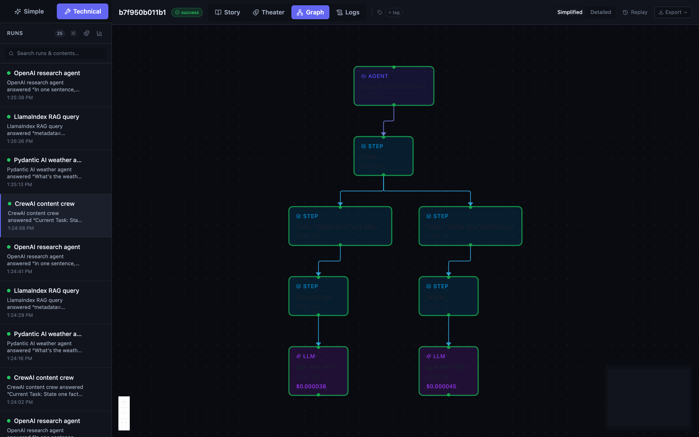
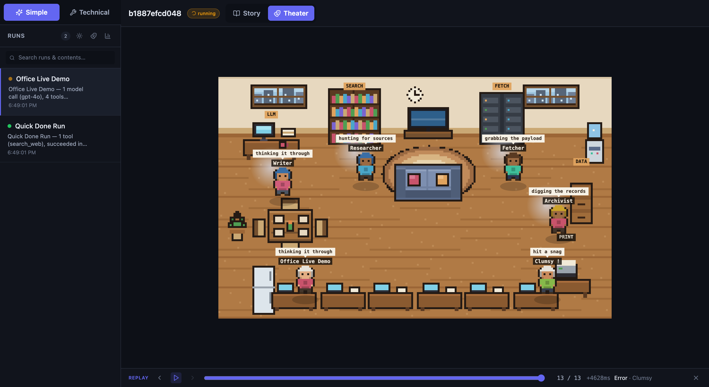

# vapviz — Visualization Agentic Process

[](https://github.com/kochrisdev/vapviz/actions/workflows/ci.yml)
[](https://www.python.org/downloads/)
[](LICENSE)

A lightweight Python + React framework for **tracing and visualizing AI agent pipelines** in real time.

Instrument your agent with a single context manager. Every step, tool call, and LLM invocation appears instantly as a live interactive graph in the browser — with inputs, outputs, durations, and error states.



*The graph view — every step, tool call, and LLM invocation as a live, interactive DAG.*



*Theater view — watch each agent as a pixel character working in a shared office, live or replayed.*

---

## Features

- **Zero-boilerplate tracing** — `with vapviz.trace("my agent")` is all you need
- **Async-native** — `async with vapviz.atrace(...)` / `run.astep(...)` for full asyncio support
- **Automatic nesting** — `ContextVar`-based parent tracking; deeply nested steps wire up correctly without any manual IDs
- **Anthropic SDK auto-instrumentation** — one call to `vapviz.patch_anthropic(client)` traces every `messages.create` call automatically (sync **and** async clients)
- **OpenAI SDK auto-instrumentation** — `vapviz.patch_openai(client)` traces every `chat.completions.create` call (sync **and** async)
- **LangGraph / LangChain integration** — `VapCallbackHandler` captures all chain, tool, and LLM calls from any LangChain-compatible framework
- **CrewAI integration** — `VapCrewAIListener` hooks into CrewAI's native event bus to trace Crews, Tasks, Agents, Tools, and LLM calls automatically
- **Pydantic AI integration** — `VapPydanticAI` wraps `Agent.run` / `run_sync` to trace each model request (tokens + cost) and tool call as nested nodes
- **LlamaIndex integration** — `VapLlamaIndex` hooks the instrumentation dispatcher to trace query engines, retrievers, embeddings, and LLM calls
- **AutoGen integration** — `VapAutoGen` traces multi-agent conversations: the chat, each agent turn, and tool calls (AG2 / `ConversableAgent`)
- **Analytics dashboard** — cross-run metrics (cost, tokens, success rate, per-model breakdown) at `GET /metrics` and in the UI
- **OpenTelemetry export** — `enable_otel_export(...)` mirrors every run into OTLP spans for Jaeger / Grafana Tempo / Datadog
- **Cost & latency budgets** — `enable_budget_alerts(Budget(...))` flags and alerts on runs that exceed cost / duration / token limits
- **Agent evals & scoring** — `eval_run(run, [checks...])` asserts cost/latency/output/custom/LLM-judge checks — regression testing for agents
- **Search & tagging** — full-text search across run contents (`GET /search`) plus persistent per-run tags, surfaced in the UI
- **Trace replay** — scrub a run event-by-event in the UI; the graph fills in node by node as it happened
- **Theater view** — watch a run as a cozy pixel office: each agent is a hand-drawn sprite that walks from its home desk to the LLM desk or a tool station (SEARCH / FETCH / DATA / PRINT, picked from the tool's name), speech bubble overhead — live or replayed
- **Office building** — a centralized monitor keyed to **apps**, drawn as a real pixel building: each app owns a room (a re-run lights the same room back up), floors hold six rooms around a Walk Way with the earliest app **walking down the stairs** when the top floor fills, and a failing app's room turns red while its agents wait it out in the rooftop **lounge** (inspect or dismiss). A coworker steps out of every **running** room to mill on the Walk Way, so the floor is alive exactly while work is happening — watch all your agents work across every app on one screen
- **Persistent storage** — `vapviz.configure(db="vapviz.db")` switches from in-memory to SQLite with zero code changes
- **CLI** — `vapviz serve --db vapviz.db` starts the server from the command line
- **Live streaming** — events flow from tracer → FastAPI → SSE → React in real time; the graph updates as the agent runs
- **Interactive graph** — ReactFlow DAG with dagre auto-layout, zoom/pan, minimap
- **Node detail panel** — click any node to inspect its inputs, outputs, token usage, duration, and errors
- **Logs view** — a clean, full-width, filterable event log of all event types with millisecond timestamps
- **Remote ingest** — push events via HTTP from any process or language (`POST /runs/{id}/events`)
- **Run comparison** — diff any two runs side by side: node diff (only A / only B / common), duration Δ, and cost Δ
- **Export** — download any run as JSON (`GET /runs/{id}/export`) or PNG (html2canvas capture)

---

## Tutorial

New to vapviz? The **[step-by-step tutorial](docs/TUTORIAL.md)** walks you from installation to a
fully instrumented agent — covering tracing, async, error handling, cost tracking, the OpenAI /
Anthropic / LangGraph / CrewAI / Pydantic AI / LlamaIndex / AutoGen integrations, remote ingest, run
comparison, export, the analytics dashboard, OpenTelemetry export, budgets, evals, search & tagging,
and trace replay.

---

## Deployment

See **[docs/DEPLOYMENT.md](docs/DEPLOYMENT.md)** for full production deployment instructions, including Docker, Nginx, Railway, Render, Fly.io, health checks, and security hardening.

---

## Quick Start

### Install (published package — UI bundled)

The published wheel ships the built UI, so the server serves it out of the box — no Node needed:

```bash
pip install vapviz            # or:  pip install "vapviz[all]"  for every integration
vapviz serve --db vapviz.db      # UI + API at http://localhost:8001
```

Open **http://localhost:8001**.

### From source (for development)

```bash
git clone https://github.com/kochrisdev/vapviz.git
cd vapviz
pip install -e ".[all]"           # + Anthropic, OpenAI, LangChain, CrewAI, Pydantic AI, LlamaIndex, AutoGen, OTel

# the UI isn't bundled in an editable install — run the dev server:
cd ui && npm install && npm run dev      # -> http://localhost:5173 (proxies to :8001)
# in another terminal:
vapviz serve --db vapviz.db                    # API on :8001
```

Open **http://localhost:5173** for the hot-reloading dev UI, or build it once
(`cd ui && npm run build`) and serve everything from one process with
`vapviz serve --db vapviz.db --static-dir ui/dist`.

---

## Core API

### Synchronous tracing

```python
import vapviz

with vapviz.trace("My Agent") as run:
    with run.step("fetch_data", kind="tool") as step:
        step.set_input({"url": "https://api.example.com/data"})
        data = fetch()
        step.set_output({"rows": len(data)})

    with run.step("analyze", kind="step") as step:
        step.set_input({"rows": len(data)})
        result = analyze(data)
        step.set_output({"summary": result})
```

### Async tracing

```python
import asyncio
import vapviz

async def run_agent():
    async with vapviz.atrace("Async Agent") as run:
        async with run.astep("plan", kind="step") as step:
            step.set_input({"goal": "research"})
            await asyncio.sleep(0.1)
            step.set_output({"urls": 3})

        # Concurrent tool calls
        results = await asyncio.gather(
            fetch_with_step(run, "https://example.com/a"),
            fetch_with_step(run, "https://example.com/b"),
        )

asyncio.run(run_agent())
```

Both `trace`/`atrace` and `step`/`astep` are interchangeable in terms of what gets recorded — use whichever matches your code's execution model.

### Node kinds

| `kind=` | Graph colour | Emits events |
|---|---|---|
| `"agent"` | Indigo | `agent_start` / `agent_end` |
| `"step"` | Sky blue | `step_start` / `step_end` |
| `"tool"` | Emerald | `tool_call` / `tool_result` |
| `"llm"` | Purple | `llm_call` / `llm_response` |

### Nesting

Steps nest automatically — no parent IDs needed:

```python
with vapviz.trace("Pipeline") as run:
    with run.step("phase_1", kind="step"):          # depth 1
        with run.step("sub_task_a", kind="tool"):   # depth 2 — auto-parented
            ...
        with run.step("sub_task_b", kind="tool"):   # depth 2 — auto-parented
            ...
```

### Cost utilities

vapviz ships a built-in pricing table covering 20+ OpenAI and Anthropic models. Use the utility directly or let the SDK patches attach cost automatically:

```python
import vapviz

# Returns USD cost as a float, or None for unknown models
cost = vapviz.calculate_cost("gpt-4o", input_tokens=1000, output_tokens=500)
# -> 0.0075

# Format for display
vapviz.format_cost(cost)          # -> "$0.0075"
vapviz.format_cost(0.000005)      # -> "<$0.0001"
```

When `patch_openai` or `patch_anthropic` is active, cost is calculated automatically and stored as `cost_usd` in every `llm` node's output data. The per-run total appears in the sidebar, and each LLM node shows its individual cost in the graph.

### Error handling

Unhandled exceptions are caught, recorded on the node as `status: error`, and re-raised — the run continues to propagate normally:

```python
with vapviz.trace("Risky Agent") as run:
    with run.step("might_fail", kind="tool") as step:
        result = risky_operation()   # if this raises, node -> error, exception re-raised
```

---

## Persistence

By default vapviz uses an in-memory store — fast, no setup required, but runs are lost when the process exits.

### SQLite persistence

```python
import vapviz

# Call once at startup, before any trace() calls
vapviz.configure(db="vapviz.db")

with vapviz.trace("My Agent") as run:
    ...
```

Or use the CLI:

```bash
vapviz serve --db vapviz.db
```

Runs are replayed from the database on startup, so you can view historical traces after restarting the server.

---

## CLI

```
vapviz serve [OPTIONS]

Options:
  --host TEXT       Bind host (default: 0.0.0.0)
  --port INT        Bind port (default: 8001)
  --db PATH         SQLite database path for persistence (default: in-memory)
  --reload          Enable auto-reload for development
  --log-level TEXT  Uvicorn log level (default: warning)
```

---

## SDK Integrations

### Anthropic

Works with both sync and async Anthropic clients:

```python
import anthropic, vapviz

client = anthropic.Anthropic()
vapviz.patch_anthropic(client)                     # sync

async_client = anthropic.AsyncAnthropic()
vapviz.patch_anthropic(async_client)               # async — same call
```

```bash
pip install "vapviz[anthropic]"
```

### OpenAI

```python
import openai, vapviz

client = openai.OpenAI()
vapviz.patch_openai(client)                        # sync

async_client = openai.AsyncOpenAI()
vapviz.patch_openai(async_client)                  # async — same call
```

```bash
pip install "vapviz[openai]"
```

Each `chat.completions.create` call becomes a purple **llm** node showing model name, messages, token usage (`input_tokens`, `output_tokens`), response text, and estimated USD cost for known models.

### LangGraph / LangChain

Pass `VapCallbackHandler` to any LangChain-compatible graph or chain:

```python
from vapviz.integrations.langchain import VapCallbackHandler

with vapviz.trace("LangGraph Agent") as run:
    handler = VapCallbackHandler(run)
    result = graph.invoke(
        {"messages": [HumanMessage(content="Research AI trends")]},
        config={"callbacks": [handler]},
    )
```

```bash
pip install "vapviz[langchain]" langgraph langchain-openai
```

Every chain invocation, tool call, and LLM call appears as a correctly nested node in the graph — no manual instrumentation needed.

### CrewAI

Register `VapCrewAIListener` once before calling `crew.kickoff()`:

```python
import vapviz
from vapviz.integrations.crewai_listener import VapCrewAIListener

vapviz.configure(db="vapviz.db")
VapCrewAIListener()          # auto mode — one new vapviz run per kickoff()

result = crew.kickoff(inputs={"topic": "AI agents"})
```

Or attach to an existing run (**manual mode**) to embed the crew inside a larger pipeline trace:

```python
with vapviz.trace("Full Pipeline") as run:
    with run.step("pre_process", kind="step") as step: ...

    VapCrewAIListener(run=run)   # tasks appear as children of this run
    crew.kickoff(inputs={...})

    with run.step("post_process", kind="step") as step: ...
```

```bash
pip install "vapviz[crewai]"
```

Every Task, Agent execution, Tool call, and LLM round-trip is captured automatically via
CrewAI's native event bus — no `verbose=True` noise, no monkey-patching.

---

### Pydantic AI

Instantiate `VapPydanticAI` once; every `agent.run()` / `run_sync()` is then traced — the agent,
each model request (with tokens and cost), and each tool call (with args and result):

```python
import vapviz
from vapviz.integrations.pydantic_ai import VapPydanticAI

vapviz.configure(db="vapviz.db")
VapPydanticAI()              # auto mode — one new vapviz run per agent.run()

result = agent.run_sync("What's the weather in Paris?")
```

Or attach to an existing run (**manual mode**) to nest the agent inside a larger pipeline:

```python
with vapviz.trace("Trip planner") as run:
    with run.step("load_preferences", kind="step") as step: ...

    VapPydanticAI(run)       # agent runs appear as children of this run
    agent.run_sync("Is Lisbon warm enough for a beach trip?")
```

```bash
pip install "vapviz[pydantic-ai]"
```

Tool calls are parented under the model request that invoked them. Call `.detach()` to restore the
original `Agent` methods.

---

### LlamaIndex

`VapLlamaIndex` registers a span handler on LlamaIndex's instrumentation dispatcher, so a whole RAG
workflow — query engine, retriever, embeddings, response synthesizer, LLM calls — is reproduced as a
nested vapviz graph with real timings. Wrap your work in a `vapviz.trace()` (manual mode):

```python
import vapviz
from llama_index.core import VectorStoreIndex
from vapviz.integrations.llamaindex import VapLlamaIndex

with vapviz.trace("RAG query") as run:
    VapLlamaIndex(run)
    index = VectorStoreIndex.from_documents(docs)
    response = index.as_query_engine().query("…")
```

Or instantiate `VapLlamaIndex()` with no run (auto mode) to make each top-level call its own vapviz run.

```bash
pip install "vapviz[llamaindex]"
```

Spans are classified by kind — retrievers and embeddings as `tool`, LLM calls as `llm`, the rest as
`step` — and nested exactly as LlamaIndex calls them. Call `.detach()` to remove the handler.

---

### AutoGen

`VapAutoGen` traces AutoGen (AG2) multi-agent conversations by wrapping `ConversableAgent`. The chat
becomes a root, each agent turn (`generate_reply`) a child node, and each tool/function call
(`execute_function`) nests under the turn that made it — with real timings.

```python
import vapviz
from vapviz.integrations.autogen import VapAutoGen

with vapviz.trace("Support chat") as run:
    VapAutoGen(run)
    user.initiate_chat(assistant, message="How do I reset my password?")
```

Or instantiate `VapAutoGen()` with no run (auto mode) to make each `initiate_chat` its own vapviz run.

```bash
pip install "vapviz[autogen]"
```

Targets the classic `autogen.ConversableAgent` API (`ag2` / `pyautogen`). Call `.detach()` to restore
the original methods.

---

## OpenTelemetry Export

vapviz can mirror every run into OpenTelemetry — one **trace per run**, with each node (agent / step /
tool / LLM) becoming a span whose parent is the node's parent. Node timings, token usage, USD cost,
and error status ride along as span timings, attributes (incl. `gen_ai.*` semantic conventions), and
status. Point it at any OTLP backend (Jaeger, Grafana Tempo, Datadog, …):

```python
import vapviz
from vapviz.integrations.otel import enable_otel_export

vapviz.configure(db="vapviz.db")
enable_otel_export(endpoint="http://localhost:4317")    # OTLP/gRPC

with vapviz.trace("My agent") as run:
    ...                                                 # exported to OTel on completion
```

Already have an OpenTelemetry stack configured globally? Call `enable_otel_export()` with no
arguments to use the existing `TracerProvider`. Or export a single run on demand with
`export_run(graph, tracer_provider=...)`.

```bash
pip install "vapviz[otel]"
```

This is **export**, not replacement — runs still appear in the vapviz UI as usual; OTel just gets a copy.

---

## Cost & Latency Budgets

Define a `Budget` (max cost, duration, and/or tokens) and vapviz will check every completed run against
it — turning the metrics it already captures into **guardrails**:

```python
import vapviz
from vapviz.budgets import Budget, enable_budget_alerts

vapviz.configure(db="vapviz.db")
enable_budget_alerts(Budget(max_cost_usd=0.05, max_duration_ms=5000))
# over-budget runs now log a warning when they finish
```

Route alerts to **built-in channels** — a webhook, a Slack incoming webhook, or an OpenTelemetry
span — and fan out to several at once (pass a list). Channels are best-effort and non-blocking (HTTP
posts run on a background thread), so a flaky endpoint never slows or breaks the traced run:

```python
from vapviz.budgets import webhook_alert, slack_alert, otel_alert

enable_budget_alerts(
    Budget(max_cost_usd=0.05, max_duration_ms=5000),
    on_alert=[
        slack_alert("https://hooks.slack.com/services/…"),
        webhook_alert("https://my-svc/alerts"),
        otel_alert(),                       # emits a vapviz.budget_exceeded span
    ],
)
```

Or pass your own callback for anything else:

```python
enable_budget_alerts(
    Budget(max_cost_usd=0.05),
    on_alert=lambda report: notify(f"{report.run_id} cost ${report.cost_usd}"),
)
```

Check a single run on demand, or via the API (`GET /runs/{id}/budget?max_cost_usd=0.02`):

```python
from vapviz.budgets import Budget, check_budget

report = check_budget(store.get_graph(run_id), Budget(max_cost_usd=0.02, max_duration_ms=3000))
for v in report.violations:
    print(f"{v.metric}: {v.actual} > {v.limit}  (+{v.pct_over:.0f}%)")
```

Try it with no API key: `python examples/budgets_demo.py`.

---

## Agent Evals & Scoring

Treat a run like a test case: assert it meets cost, latency, and correctness checks. `eval_run`
returns an `EvalResult` with a per-check breakdown and an overall score — drop it straight into pytest
or CI to catch agent regressions.

```python
import vapviz
from vapviz.evals import eval_run, max_cost, max_latency, no_errors, output_contains, judge

with vapviz.trace("support agent") as run:
    ...   # run your agent

result = eval_run(run, [
    max_cost(0.02),
    max_latency(3.0),
    no_errors(),
    output_contains("ticket"),
    judge("helpful", my_llm_scorer),     # you supply the scoring fn — stays provider-agnostic
])

assert result.passed, result.summary()
```

Built-in checks: `max_cost`, `max_latency`, `max_tokens`, `no_errors`, `output_contains`, plus
`custom(name, fn)` and `judge(name, fn)` for your own predicates / LLM-as-judge. Each check yields a
0–1 score; `result.score` is their mean.

Run the same checks over HTTP with declarative specs (`POST /runs/{id}/eval`):

```bash
curl -X POST http://localhost:8001/runs/{run_id}/eval \
  -H "Content-Type: application/json" \
  -d '[{"type":"max_cost","value":0.02},{"type":"output_contains","value":"ticket"}]'
```

Try it with no API key: `python examples/evals_demo.py`.

---

## Search & Tagging

Find runs by content and organise them with tags — handy once a store holds hundreds of runs.

**Search** matches a free-text query across run labels and every node's input/output, with optional
structural filters (`status`, `kind`, `tool`, `tag`):

```bash
curl "http://localhost:8001/search?q=paris"             # any run whose contents mention "paris"
curl "http://localhost:8001/search?tool=search_web&status=error"
curl "http://localhost:8001/search?tag=prod"
```

**Tags** are persistent per-run labels (stored in SQLite when you use `--db`):

```bash
curl -X PUT http://localhost:8001/runs/{id}/tags \
  -H "Content-Type: application/json" -d '{"tags": ["prod", "v2-prompt"]}'
```

In the UI, the search box does the content search, each run shows its tags as chips (click one to
filter), and the run header has an inline tag editor (add with **+ tag**, remove with **×**).

---

## REST API

The FastAPI server (`http://localhost:8001`) exposes:

| Method | Endpoint | Description |
|---|---|---|
| `GET` | `/runs` | List all runs (summary, incl. tags) |
| `GET` | `/search` | Search runs by query / status / kind / tool / tag |
| `GET` | `/metrics` | Cross-run analytics: cost, tokens, success rate, per-model breakdown |
| `GET` | `/runs/{id}` | Single run summary |
| `GET` | `/runs/{id}/graph` | Full graph snapshot (nodes + edges) |
| `GET` | `/runs/{id}/budget` | Check a run against a budget (`?max_cost_usd=&max_duration_ms=&max_total_tokens=`) |
| `POST` | `/runs/{id}/eval` | Evaluate a run against declarative check specs → `EvalResult` |
| `GET` / `PUT` | `/runs/{id}/tags` | Get / replace a run's tags |
| `GET` | `/runs/{id}/export` | Download run graph as a JSON file attachment |
| `GET` | `/runs/{id}/events` | **SSE stream** — replays history then pushes live |
| `GET` | `/runs/compare?a={id}&b={id}` | Return two run graphs for comparison |
| `POST` | `/runs/{id}/events` | Ingest an event from a remote process |
| `DELETE` | `/runs` | Clear all runs from store |
| `DELETE` | `/runs/{id}` | Delete a single run |

Interactive docs: **http://localhost:8001/docs**

### SSE event types

The stream emits named SSE events matching the `type` field of each `VapEvent`:

```
agent_start  agent_end
step_start   step_end
tool_call    tool_result
llm_call     llm_response
state_update
error
```

---

## Project Structure

```
vapviz/                          Python package
├── __init__.py               Public API: trace, atrace, configure, patch_anthropic
├── events.py                 Pydantic models — VapEvent, GraphNode, RunGraph
├── store.py                  RunStore ABC + MemoryStore + thread-safe pub/sub
├── tracer.py                 trace/atrace context managers, ContextVar nesting
├── server.py                 FastAPI app — REST + SSE endpoints
├── cli.py                    vapviz serve command
├── cost.py                   Token cost — 20+ model pricing table, calculate_cost()
├── metrics.py                Cross-run analytics — compute_metrics() aggregation
├── budgets.py                Cost/latency budgets — check_budget(), enable_budget_alerts()
├── evals.py                  Agent evals — eval_run(), checks, scoring
├── search.py                 Run search — run_matches() predicate
├── backends/
│   ├── __init__.py
│   └── sqlite.py             SqliteStore — WAL-mode SQLite persistence
└── integrations/
    ├── anthropic_sdk.py      patch_anthropic() — sync + async client support
    ├── openai_sdk.py         patch_openai() — sync + async client support
    ├── langchain.py          VapCallbackHandler — LangGraph / LangChain integration
    ├── crewai_listener.py    VapCrewAIListener — CrewAI event bus integration
    ├── pydantic_ai.py        VapPydanticAI — Pydantic AI Agent.run wrapper
    ├── llamaindex.py         VapLlamaIndex — LlamaIndex span handler
    ├── autogen.py            VapAutoGen — AutoGen ConversableAgent tracer
    └── otel.py               OpenTelemetry export — runs → OTLP spans

ui/src/                       Vite + React + TypeScript
├── App.tsx                   Root layout — sidebar / graph / timeline / detail panel
├── components/
│   ├── AgentGraph.tsx        ReactFlow DAG with dagre auto-layout
│   ├── Dashboard.tsx         Cross-run analytics view (GET /metrics)
│   ├── LogsView.tsx          Full-width, filterable event log
│   ├── ExportMenu.tsx        Export dropdown (JSON download + PNG capture)
│   ├── NodeDetail.tsx        Selected-node inspector
│   ├── RunComparison.tsx     Side-by-side diff of two runs
│   ├── RunList.tsx           App-grouped sidebar (expand → run history) with search, tags, compare + dashboard toggle
│   ├── TagEditor.tsx         Inline per-run tag editor
│   ├── ReplayBar.tsx         Time-travel scrubber (play/step over a run's events)
│   ├── OfficeStage.tsx       Sprite office — canvas room + walking cast (Theater full-size, Building compact)
│   ├── TheaterView.tsx       Per-run Theater tab (wraps OfficeStage)
│   ├── BuildingView.tsx      Office Building — every app's room across stacked floors + walk overlay
│   └── LoungeStage.tsx       The shared rooftop lounge (break-room diorama + idling agents)
├── hooks/
│   └── useRunStream.ts       SSE hook — subscribes to /runs/{id}/events
├── lib/
│   ├── replay.ts             buildGraphAt() — rebuild the graph as of event N
│   ├── building.ts           buildBuilding() — apps → rooms/floors/lounge placement
│   ├── sprites.ts            Art-as-data sprite engine (12×16 worker, per-agent recolor)
│   ├── officeArt.ts          Room furniture + the locked office layout (owned pixel art)
│   ├── loungeArt.ts          Break-room diorama + door/stair icons (owned pixel art)
│   ├── walkOverlay.ts        Cross-floor walk engine (descend the stairs, walk to the lounge)
│   ├── officeScene.ts        Tool→station routing + per-agent call lookup + dialogue
│   └── theater.ts            buildScene() — graph → who's where / doing what
├── store/
│   └── runStore.ts           Zustand store — builds graph state from events
└── types/
    └── events.ts             TypeScript mirror of Python event models

examples/
├── simple_demo.py            Multi-step fake agent — no API key needed
├── async_demo.py             Async agent with concurrent steps (asyncio.gather)
├── error_handling_demo.py    Three error scenarios — leaf, nested, partial failure
├── cost_tracking_demo.py     Simulated LLM cost overlay — no API key needed
├── remote_ingest_demo.py     HTTP POST ingest from a separate process (stdlib only)
├── anthropic_demo.py         Real Claude API calls with auto-tracing
├── openai_demo.py            OpenAI chat.completions with auto-tracing
├── langgraph_demo.py         LangGraph ReAct agent with VapCallbackHandler
├── crewai_demo.py            CrewAI multi-agent crew with VapCrewAIListener
├── pydantic_ai_demo.py       Pydantic AI agent with VapPydanticAI — no API key needed
├── llamaindex_demo.py        LlamaIndex RAG query with VapLlamaIndex — no API key needed
├── autogen_demo.py           AutoGen multi-agent chat with VapAutoGen — no API key needed
├── otel_demo.py              OpenTelemetry export to the console — no API key needed
├── budgets_demo.py           Cost/latency budget alerting — no API key needed
└── evals_demo.py             Agent evals / assertions — no API key needed

docs/
├── TUTORIAL.md               Step-by-step learning guide (start here)
├── ARCHITECTURE.md           Internal design — event flow, store, React state machine
├── DEVELOPER_REFERENCE.md    Complete Python API, CLI, REST, SSE, TypeScript types
└── DEPLOYMENT.md             Docker, Nginx, cloud platforms, security

tests/
├── conftest.py               Shared fixtures
├── test_tracer.py            Sync/async tracing, nesting, ContextVar, errors
├── test_store.py             MemoryStore, SqliteStore, graph mutation
├── test_server.py            REST endpoints
├── test_openai_patch.py      OpenAI integration (mock, no API key)
├── test_anthropic_patch.py   Anthropic integration (mock, no API key)
├── test_langchain.py         LangChain handler (skipped if langchain-core absent)
├── test_cost.py              Pricing table, calculate_cost(), integration cost output
├── test_metrics.py           compute_metrics() aggregation + /metrics endpoint
├── test_crewai_listener.py   CrewAI listener (skipped if crewai absent)
├── test_pydantic_ai.py       Pydantic AI integration (skipped if pydantic-ai absent)
├── test_llamaindex.py        LlamaIndex integration (skipped if llama-index-core absent)
├── test_autogen.py           AutoGen integration (skipped if autogen absent)
├── test_otel.py              OpenTelemetry export (skipped if opentelemetry-sdk absent)
├── test_budgets.py           Budget checks, alerting, and the /budget endpoint
├── test_evals.py             Eval checks, scoring, declarative specs, /eval endpoint
└── test_search.py            Search predicate, store tags (incl. SQLite), endpoints

run_dev.py                    One-command dev entry point (server + demo agent)
pyproject.toml                Python package metadata + dependencies
```

---

## Running the Examples

### Simple demo (no API key)

```bash
python examples/simple_demo.py
```

Starts the server on `:8001` in a background thread, runs a simulated research agent, then waits for Enter.

### Async demo (no API key)

```bash
python examples/async_demo.py

# Or push to an already-running server:
vapviz serve --db vapviz.db
python examples/async_demo.py --agent-only
```

Demonstrates `atrace`, `astep`, and `asyncio.gather` for concurrent fan-out tool calls.

### Error handling demo (no API key)

```bash
python examples/error_handling_demo.py
```

Runs three separate traces that each demonstrate a different failure mode:
- **Leaf failure** — a tool raises `ConnectionError`; the caller catches it, a fallback step continues
- **Nested failure** — a child step raises `ValueError` which propagates to mark the parent node red too
- **Partial failure** — one of three parallel fetches fails while the others succeed; a downstream merge step still runs

Failed nodes appear red in the graph; successfully-completed nodes stay green.

### Cost tracking demo (no API key)

```bash
python examples/cost_tracking_demo.py
```

Simulates three LLM pipelines (gpt-4o-mini, gpt-4o, mixed-model) using `vapviz.calculate_cost()` to attach
`cost_usd` to each node. Shows per-node cost labels (purple) in the graph and per-run totals in the
sidebar. Select two runs and click ⊕ to compare costs side by side.

### Remote ingest demo (no API key, no vapviz import in agent)

```bash
python examples/remote_ingest_demo.py

# Or push to an already-running server:
vapviz serve --db vapviz.db
python examples/remote_ingest_demo.py --agent-only --server-url http://localhost:8001
```

Demonstrates the HTTP ingest pattern: the "agent" process uses only `urllib.request` (no `vapviz` import)
and POSTs `VapEvent` JSON payloads directly to `POST /runs/{run_id}/events`. Useful for polyglot
architectures where the agent runs in a different language or on a separate machine.

### Anthropic demo

```bash
pip install "vapviz[anthropic]"
export ANTHROPIC_API_KEY=sk-ant-...
python examples/anthropic_demo.py
```

### OpenAI demo

```bash
pip install "vapviz[openai]"
export OPENAI_API_KEY=sk-...
python examples/openai_demo.py
```

Runs three `gpt-4o-mini` calls and traces each as a nested `llm` node.

### LangGraph demo

```bash
pip install "vapviz[langchain]" langgraph langchain-openai
export OPENAI_API_KEY=sk-...
python examples/langgraph_demo.py
```

Runs a ReAct agent with three tools (`search_web`, `calculate`, `summarize_findings`). Every chain step, tool call, and LLM round-trip is traced automatically via `VapCallbackHandler`.

### CrewAI demo

```bash
pip install "vapviz[crewai]"
export OPENAI_API_KEY=sk-...
python examples/crewai_demo.py
```

Runs two traces:
1. **Auto mode** — a two-agent sequential crew (researcher → writer). `VapCrewAIListener()` is registered once and auto-creates a vapviz run per `kickoff()`.
2. **Manual mode** — the same crew embedded inside a larger `vapviz.trace()` pipeline with pre/post-processing steps on either side.

### Pydantic AI demo

```bash
pip install "vapviz[pydantic-ai]"
python examples/pydantic_ai_demo.py        # no API key needed — uses TestModel
```

Runs two traces — a weather agent (auto mode) and a trip planner embedded in a pipeline (manual mode). Each model request and tool call appears as a nested node, with tools parented under the model request that called them.

### LlamaIndex demo

```bash
pip install "vapviz[llamaindex]"
python examples/llamaindex_demo.py        # no API key needed — uses MockLLM + MockEmbedding
```

Builds a small index and runs a RAG query, traced under one vapviz run. The graph shows the full pipeline — query engine → retriever → embeddings → response synthesizer → LLM — with retrievers/embeddings as `tool` nodes and LLM calls as `llm` nodes.

### AutoGen demo

```bash
pip install "vapviz[autogen]"
python examples/autogen_demo.py        # no API key needed — offline ConversableAgents
```

Runs a scripted two-agent conversation (researcher → writer), traced under one vapviz run. The graph shows the chat with each agent turn nested beneath it.

### OpenTelemetry export demo

```bash
pip install "vapviz[otel]"
python examples/otel_demo.py        # no API key, no collector — prints spans to the console
```

Traces a small agent and exports it to OpenTelemetry via the `ConsoleSpanExporter`, so you can see the run reproduced as a single OTel trace (swap in an OTLP endpoint to send it to Jaeger/Tempo/Datadog).

---

## Configuration Reference

```python
import vapviz

# Use SQLite persistence (call once at startup)
vapviz.configure(db="vapviz.db")

# Use in-memory store (default)
vapviz.configure()

# Custom store passed directly
from vapviz import Tracer, MemoryStore
store = MemoryStore()
tracer = Tracer(store=store)

with tracer.trace("isolated run") as run:
    ...
```

---

## Roadmap

**What's next:** see **[ROADMAP.md](ROADMAP.md)** for the post-1.0 plan. The release history below
records what's already shipped (full detail in [CHANGELOG.md](CHANGELOG.md)).

### v0.2.0 — Phase 1 (complete)
- [x] **Persistent storage** — SQLite backend with WAL mode, replay on startup
- [x] **Async tracer** — `atrace` / `astep` with `asynccontextmanager`
- [x] **CLI** — `vapviz serve --db <path>`
- [x] **Async Anthropic** — `patch_anthropic` detects `AsyncAnthropic` automatically
- [x] **Single-run REST** — `GET /runs/{id}`, `DELETE /runs/{id}`

### v0.3.0 — Phase 2 (complete)
- [x] **OpenAI SDK integration** — `patch_openai(client)` for sync + async clients
- [x] **LangGraph / LangChain integration** — `VapCallbackHandler` for any LangChain-compatible framework
- [x] **Test suite** — 90 tests covering tracer, stores, server, and integrations

### v0.4.0 — Phase 3 (complete)
- [x] **Token cost overlay** — per-node USD cost on every LLM call, total cost per run in sidebar
- [x] **Pricing table** — 20+ OpenAI and Anthropic models with prefix-match fallback
- [x] **`vapviz.calculate_cost(model, input_tokens, output_tokens)`** — public cost utility

### v0.5.0 — Phase 4 (complete)
- [x] **Run comparison** — diff two runs side by side; stats header (duration Δ, cost Δ, node diff), side-by-side ReactFlow graphs
- [x] **Export** — download run as JSON (`GET /runs/{id}/export`) or PNG (html2canvas capture of the graph canvas)
- [x] **`GET /runs/compare?a={id}&b={id}`** — server endpoint returning both graphs in one request
- [x] **Compare mode in sidebar** — hover any run to see the ⊕ compare button; amber highlight + banner when active

### v0.6.0 — Phase 5 (complete)
- [x] **CrewAI integration** — `VapCrewAIListener` hooks into CrewAI's native `BaseEventListener` event bus; traces Crews, Tasks, Agent executions, Tool calls, and LLM round-trips automatically
- [x] **Auto + manual mode** — auto mode creates a new vapviz run per `kickoff()`; manual mode attaches the crew as a sub-section of an existing `vapviz.trace()` pipeline
- [x] **LLM cost on CrewAI nodes** — `cost_usd` auto-attached via LiteLLM usage dict; `pip install "vapviz[crewai]"`
- [x] **19-test suite** — `tests/test_crewai_listener.py` covers crew lifecycle, task/agent/tool/LLM nodes, cost tracking, and import guard

### v0.7.0 — Phase 6 (complete)
- [x] **Analytics dashboard** — cross-run overview in the UI: run/success counts, total & average cost, average duration, LLM-call and token totals
- [x] **Per-model breakdown** — calls, tokens, and USD cost grouped by model, sorted by spend
- [x] **Cost-over-time chart** + nodes-by-kind breakdown; auto-refreshes every 5s
- [x] **`GET /metrics`** — `compute_metrics()` aggregates every stored run into one snapshot; 14-test suite in `tests/test_metrics.py`

### v0.8.0 — Phase 7 (complete)
- [x] **Pydantic AI integration** — `VapPydanticAI` wraps `Agent.run` / `run_sync`; reconstructs the agent, each model request, and each tool call as nested nodes from the run's message history
- [x] **Auto + manual mode** — auto mode creates a new vapviz run per `agent.run()`; manual mode nests the agent inside an existing `vapviz.trace()` pipeline
- [x] **Per-request tokens & cost** — `cost_usd` attached per model request via the pricing table; tools parented under the model request that called them
- [x] **13-test suite** — `tests/test_pydantic_ai.py` (TestModel/FunctionModel, no API key); `pip install "vapviz[pydantic-ai]"`

### v0.9.0 — Phase 8 (complete)
- [x] **OpenTelemetry export** — `enable_otel_export(...)` mirrors each completed run into OTLP spans (one trace per run; node hierarchy → span parent/child) for Jaeger / Grafana Tempo / Datadog
- [x] **GenAI semantics** — `gen_ai.request.model`, `gen_ai.usage.{input,output}_tokens`, `vapviz.cost_usd`, and ERROR status carried as span attributes/status with real node timings
- [x] **Flexible wiring** — bring your own `TracerProvider`, pass an OTLP `endpoint`, or use a globally-configured OpenTelemetry stack; `export_run()` for one-shot export
- [x] **11-test suite** — `tests/test_otel.py` (in-memory exporter, no network); `pip install "vapviz[otel]"`

### v0.10.0 — Phase 9 (complete)
- [x] **LlamaIndex integration** — `VapLlamaIndex` registers a span handler on the instrumentation dispatcher; query engines, retrievers, embeddings, response synthesizers, and LLM calls become nested vapviz nodes with real timings
- [x] **Kind classification** — retrievers/embeddings → `tool`, LLM calls → `llm`, the rest → `step`; span tree maps onto the node hierarchy via `parent_span_id`
- [x] **Auto + manual mode** — manual nests a whole RAG workflow under one `vapviz.trace()`; auto makes each top-level call its own run
- [x] **8-test suite** — `tests/test_llamaindex.py` (MockLLM/MockEmbedding, no API key); `pip install "vapviz[llamaindex]"`

### v0.11.0 — Phase 10 (complete)
- [x] **AutoGen integration** — `VapAutoGen` wraps `ConversableAgent` (AG2 / `pyautogen`); a multi-agent conversation becomes the chat root, an agent-turn node per `generate_reply`, and tool nodes per `execute_function`, nested with real timings
- [x] **Auto + manual mode** — manual nests a conversation under one `vapviz.trace()`; auto makes each `initiate_chat` its own run; thread-local node stack handles nested chats and tool nesting
- [x] **8-test suite** — `tests/test_autogen.py` (offline `register_reply` agents, no API key); `pip install "vapviz[autogen]"`

### v0.12.0 — Phase 11 (complete)
- [x] **Cost & latency budgets** — `Budget` (max cost / duration / tokens) + `check_budget(graph, budget)` returning per-metric violations
- [x] **Alerting** — `enable_budget_alerts(budget, on_alert=…)` checks every completed run and fires a callback (default: logs a warning) on violations
- [x] **`GET /runs/{id}/budget`** — check any run against a budget via query params
- [x] **13-test suite** — `tests/test_budgets.py`; `vapviz.Budget` / `vapviz.check_budget` / `vapviz.enable_budget_alerts` exported

### v0.13.0 — Phase 12 (complete)
- [x] **Agent evals & scoring** — `eval_run(run, [checks…])` → `EvalResult` with per-check pass/fail and an overall score; built-in `max_cost` / `max_latency` / `max_tokens` / `no_errors` / `output_contains`, plus `custom` and `judge` (LLM-as-judge) hooks
- [x] **Declarative checks** — JSON specs via `run_checks()` and `POST /runs/{id}/eval` for cross-language / UI use
- [x] **Regression-testing workflow** — drop `assert eval_run(...).passed` into pytest/CI
- [x] **20-test suite** — `tests/test_evals.py`; eval API exported from `vapviz`

### v0.14.0 — Phase 13 (complete)
- [x] **Run search** — `GET /search` matches a free-text query across run labels and node inputs/outputs, with `status` / `kind` / `tool` / `tag` filters (`vapviz/search.py` `run_matches`)
- [x] **Tags** — persistent per-run tags (`GET`/`PUT /runs/{id}/tags`), stored in SQLite, surfaced in `RunSummary.tags`
- [x] **UI** — content search box, tag chips on runs (click to filter), and an inline tag editor in the run header
- [x] **18-test suite** — `tests/test_search.py` (predicate, in-memory + SQLite tag persistence, endpoints)

### v0.15.0 — Phase 14 (complete)
- [x] **Trace replay / time-travel** — a UI scrubber that replays a run event-by-event; the graph fills in node by node, with play/pause and step controls
- [x] **`buildGraphAt(events, n)`** — pure client-side reducer that rebuilds the graph as of event *n* (mirrors the store's event→graph logic)
- [x] **`ReplayBar.tsx`** + a Replay toggle in the run header; resets when the selected run changes

### Phase 15 — Theater & Live Floor (complete)
- [x] **Theater view** — a watchable per-run view: each agent is a deterministic pixel character (built from its name) that walks to an LLM/tool desk while working, name overhead; live or replayed. A 4th run tab
- [x] **Pixel-character engine** (`lib/avatar.ts`) + **scene model** (`lib/theater.ts`) + shared **`AgentStage.tsx`** room/walking renderer
- [x] **Live Floor** (`FloorView.tsx`, sidebar 🎭) — every active/recent run as a soft zone on one office floor, each a live `AgentStage`; polls existing endpoints, no backend change
- [x] **LangGraph cast** — additive `langgraph_node` marker in the LangChain integration so multi-agent graphs show their real agents (supervisor / workers)

### Phase 16 — Theater sprite office (complete)
- [x] **Art-as-data sprites** — the Theater stage rebuilt on hand-authored 12×16 pixel sprites (palette + char-grid data, rasterized to canvas, recolored deterministically per agent; owned art, zero AI, zero third-party packs): `lib/sprites.ts` + the locked room layout in `lib/officeArt.ts`
- [x] **Tool→station routing** — five stations (LLM desk, SEARCH shelves, FETCH racks, DATA cabinet, PRINT table); a running tool call keyword-matches to its station (`lib/officeScene.ts`), agents walk with duration-adaptive speed and say what they're doing in a speech bubble
- [x] **`OfficeStage.tsx`** — the canvas renderer behind the Theater tab; the Live Floor keeps the compact SVG `AgentStage` for its zones

### Phase 17 — One stage engine (complete)
- [x] **Live Floor on the sprite office** — `FloorView`'s run-zones now tile `OfficeStage` in a new `compact` mode (station chips + speech bubbles dropped at zone scale, name tags keep a legible floor; glow / walk / ✓ ! cues carry the signal)
- [x] **Interim SVG stage retired** — `AgentStage.tsx` + `lib/avatar.ts` (and their CSS) deleted; Theater and Floor share one renderer, one art set, one per-agent colorway

### Phase 18 — Office Building & app identity (complete)
- [x] **`app_id`** — optional `vapviz.trace(label, app_id=…)` / `atrace(…)` pipeline identity; rides in the run's start-event data (additive — no event→graph change) and surfaces as `RunSummary.app_id`
- [x] **Office Building** (`BuildingView.tsx`, replaces `FloorView.tsx`) — the Floor re-keyed from run instances to **apps** (grouping key `app_id ?? label`): app = room reused across re-runs, agent = stable desk, **6 rooms per floor** with the earliest app descending when the top floor fills (finished preferred; floors grow downward only), and a top-floor **incident hall** for failing apps (inspect + **dismiss**; dismissals key on the failed run id, persist in `localStorage`, and are pruned against the live roster). Rooms glide to new positions (FLIP), disabled under reduced motion
- [x] **`lib/building.ts`** — pure `buildBuilding(runs, prev, dismissed)` placement reducer (stay put → incidents → seat new → descend cascade), unit-tested like the other scene reducers
- [x] **App-grouped sidebar** — `RunList` groups runs into apps (current-run status dot, ×N run count, plain-language subtitle); expand an app for its run history, click a run to inspect and replay it

### Phase 19 — The visual Office Building (complete)
- [x] **The building shell** — roof + `VAPVIZ` sign, floor slabs, each floor a **2×3 room grid around a central Walk Way**, a **Door/Stairs** descent column, a solid east wall + windows, and a **lobby directory board** with the live tally (apps working · in the lounge · spend today)
- [x] **The Lounge** — the incident hall reimagined as a shared rooftop break room (hand-authored diorama: coffee machine, vending machine, kitchen counter, water cooler, fridge, table, plants). A failing app's room now **stays in place and turns red** while the app surfaces to the lounge — inspect + dismiss unchanged; each waiting agent idles differently (`lib/loungeArt.ts`, `LoungeStage.tsx`)
- [x] **The walk overlay** (`lib/walkOverlay.ts`) — a sprite layer above the rooms: a descending app's coworker walks the Walk Way, enters the Stairs (vanishing), and emerges from the Door one floor below; a failing app's coworker walks up to the lounge. FLIP glide is the fallback; `prefers-reduced-motion` snaps everything

### Phase 20 — Floor life / room doors (complete)
- [x] **Room doors** — each room gains a door on its Walk-Way-facing edge (drawn by the floor environment since Phase 21); the locked 12×16 room diorama is untouched
- [x] **Living floor** — the walk overlay grows a persistent layer (`reconcileFloorLife`, driven each poll): a coworker steps out of every **running** room and mills on that floor's Walk Way, going back inside when the app finishes — so the floor is alive while work is happening, not just during a transition
- [x] **Honest by design** — a walker on the corridor means real work: exactly one per running room, nothing decorative (the interim ambient stroll was removed in Phase 21); a quiet floor is an empty corridor. `prefers-reduced-motion` → no floor life

### Phase 21 — The actual floor (complete)
- [x] **Floor environment canvas** — each floor drawn as one pixel scene from measured DOM rects (`lib/floorArt.ts`, `FloorEnv.tsx`): stone corridor tiles, shared wall runs with a drawn door threshold per room, the Door/Stairs alcove, and east-wall windows — hand-authored owned art, zero AI
- [x] **Props** — runner rug + ceiling lights down the Walk Way, plants, water cooler, cork notice board, framed wall art, wall clock; empty rooms read as unlet offices
- [x] **Nameplates** — rooms drop their CSS card chrome; each app's name + status LED hangs on the wall by its door (crisp DOM text on art-styled signage)

---

## Dependencies

### Python
| Package | Role |
|---|---|
| `fastapi` | REST + SSE server |
| `uvicorn` | ASGI server |
| `pydantic` | Event schema validation |
| `sse-starlette` | Server-Sent Events support |
| `anthropic` *(optional)* | Anthropic SDK integration (`pip install "vapviz[anthropic]"`) |
| `openai` *(optional)* | OpenAI SDK integration (`pip install "vapviz[openai]"`) |
| `langchain-core` *(optional)* | LangGraph/LangChain integration (`pip install "vapviz[langchain]"`) |
| `crewai` *(optional)* | CrewAI integration (`pip install "vapviz[crewai]"`) |
| `pydantic-ai-slim` *(optional)* | Pydantic AI integration (`pip install "vapviz[pydantic-ai]"`) |
| `llama-index-core` *(optional)* | LlamaIndex integration (`pip install "vapviz[llamaindex]"`) |
| `ag2` *(optional)* | AutoGen integration (`pip install "vapviz[autogen]"`) |
| `opentelemetry-sdk` + `opentelemetry-exporter-otlp` *(optional)* | OpenTelemetry export (`pip install "vapviz[otel]"`) |

`sqlite3` is part of the Python standard library — no extra install needed for persistence.

### UI
| Package | Role |
|---|---|
| `@xyflow/react` | Graph canvas (ReactFlow v12) |
| `dagre` | Automatic DAG layout |
| `html2canvas` | PNG snapshot of the graph canvas |
| `zustand` | Client-side state management |
| `tailwindcss` | Utility CSS |
| `lucide-react` | Icons |
| `@fontsource/silkscreen` · `@fontsource/pixelify-sans` · `@fontsource/vt323` | Self-hosted pixel typefaces (display · body · mono; OFL) |

---

## Development

See [CONTRIBUTING.md](CONTRIBUTING.md) for the full contributor guide. Quick start:

```bash
# Install with all integration + dev dependencies
pip install -e ".[dev]"

# Run the Python test suite (303 tests; integration tests skip if the
# corresponding framework isn't installed)
pytest -q

# Build and type-check the React UI
cd ui && npm ci && npm run build

# Build the distributable package and validate its metadata
python -m build
python -m twine check dist/*
```

**Continuous integration** — [`.github/workflows/ci.yml`](.github/workflows/ci.yml) runs the test
suite on Python 3.11 / 3.12 / 3.13, builds and type-checks the UI, and builds + `twine check`s the
package on every push and pull request to `main`.

**Releasing** — bump `version` in [`pyproject.toml`](pyproject.toml), then push a matching tag:

```bash
git tag v0.8.0 && git push origin v0.8.0
```

[`.github/workflows/release.yml`](.github/workflows/release.yml) builds the distribution, verifies
the tag matches the package version, and publishes to PyPI via
[Trusted Publishing](https://docs.pypi.org/trusted-publishers/) (OIDC — no API token needed; requires
a one-time PyPI publisher configured for the `release.yml` workflow and the `pypi` environment).

---

## Versioning & Stability

vapviz follows [Semantic Versioning](https://semver.org/). Release notes live in
[CHANGELOG.md](CHANGELOG.md) (and, in detail, the
[Developer Reference changelog](docs/DEVELOPER_REFERENCE.md#changelog)).

**Public, stability-tracked surface** (changes here follow semver):

- The `vapviz` package's top-level exports — `trace` / `atrace`, `configure`, `Tracer`, `patch_openai`,
  `patch_anthropic`, `calculate_cost`, `compute_metrics`, `Budget` / `check_budget` /
  `enable_budget_alerts`, `eval_run` and the check builders, and the event/graph models.
- The framework integrations under `vapviz.integrations.*` — `VapCrewAIListener`, `VapPydanticAI`,
  `VapLlamaIndex`, `VapAutoGen`, `VapCallbackHandler`, and `enable_otel_export` (imported from their
  modules, e.g. `from vapviz.integrations.llamaindex import VapLlamaIndex`).
- The `vapviz serve` CLI flags and the documented [REST API](#rest-api) + SSE event schema
  (`VapEvent.schema_version` tracks the wire format).

**Not covered**: names prefixed with `_`, internal store layout, and the React UI's internal
component structure.

---

## License

[MIT](LICENSE) © kochrisdev
